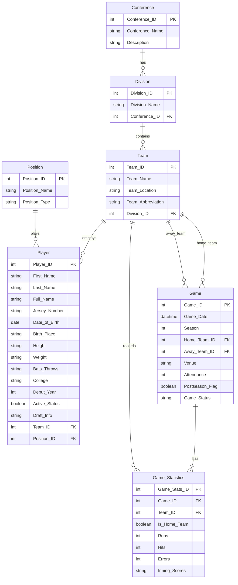

# IS441 Baseball Database - Entity-Relationship Diagram (ERD)

## Visual ERD

```
┌─────────────────┐
│   Conference    │
│─────────────────│
│ PK Conference_ID│
│    Conference_  │
│       Name      │
│    Description  │
└────────┬────────┘
         │
         │ 1:M
         │
         ▼
┌─────────────────┐
│    Division     │
│─────────────────│
│ PK Division_ID  │
│    Division_Name│
│ FK Conference_ID│
└────────┬────────┘
         │
         │ 1:M
         │
         ▼
┌─────────────────────────┐           ┌──────────────────┐
│         Team            │           │     Position     │
│─────────────────────────│           │──────────────────│
│ PK Team_ID              │           │ PK Position_ID   │
│    Team_Name            │           │    Position_Name │
│    Team_Location        │           │    Position_Type │
│    Team_Abbreviation    │           └────────┬─────────┘
│ FK Division_ID          │                    │
└──────┬──────────────┬───┘                    │
       │              │                        │
       │ 1:M          │ 1:M                    │ 1:M
       │              │                        │
       │              │                        │
       ▼              │                        ▼
┌─────────────────────┼─────────────────────────────────┐
│                     │           Player                │
│                     │  ───────────────────────────────│
│                     │  PK Player_ID                   │
│                     │     First_Name                  │
│                     │     Last_Name                   │
│                     │     Full_Name                   │
│                     │     Jersey_Number               │
│                     │     Date_of_Birth               │
│                     │     Birth_Place                 │
│                     │     Height                      │
│                     │     Weight                      │
│                     │     Bats_Throws                 │
│                     │     College                     │
│                     │     Debut_Year                  │
│                     │     Active_Status               │
│                     │     Draft_Info                  │
│                     │  FK Team_ID                     │
│                     │  FK Position_ID                 │
│                     └─────────────────────────────────┘
│
│ 1:M (Home)
│
▼
┌─────────────────────────────┐
│           Game              │
│─────────────────────────────│
│ PK Game_ID                  │
│    Game_Date                │
│    Season                   │
│ FK Home_Team_ID ────────────┼────┐
│ FK Away_Team_ID ────────────┼────┼─── 1:M (Away)
│    Venue                    │    │
│    Attendance               │    │
│    Postseason_Flag          │    │
│    Game_Status              │    │
└────────┬────────────────────┘    │
         │                         │
         │ 1:2                     │
         │                         │
         ▼                         │
┌─────────────────────────────┐    │
│     Game_Statistics         │    │
│─────────────────────────────│    │
│ PK Game_Stats_ID            │    │
│ FK Game_ID                  │    │
│ FK Team_ID ◄────────────────┼────┘
│    Is_Home_Team             │
│    Runs                     │
│    Hits                     │
│    Errors                   │
│    Inning_Scores            │
└─────────────────────────────┘
```

---

## Mermaid ERD (for online rendering)

Copy and paste the code below into a Mermaid Live Editor (https://mermaid.live/) to view:



---

## Relationship Details

### Conference → Division (1:M)
- **Cardinality:** One conference has many divisions (3 per conference)
- **Participation:** Division must belong to exactly one conference (mandatory)
- **FK:** Division.Conference_ID references Conference.Conference_ID

### Division → Team (1:M)
- **Cardinality:** One division has many teams (5 per division)
- **Participation:** Team must belong to exactly one division (mandatory)
- **FK:** Team.Division_ID references Division.Division_ID

### Team → Player (1:M)
- **Cardinality:** One team has many players
- **Participation:** Player must belong to exactly one team (mandatory)
- **FK:** Player.Team_ID references Team.Team_ID

### Position → Player (1:M)
- **Cardinality:** One position has many players
- **Participation:** Player must have exactly one primary position (mandatory)
- **FK:** Player.Position_ID references Position.Position_ID

### Team → Game (1:M, Home Team)
- **Cardinality:** One team plays many home games
- **Participation:** Game must have exactly one home team (mandatory)
- **FK:** Game.Home_Team_ID references Team.Team_ID

### Team → Game (1:M, Away Team)
- **Cardinality:** One team plays many away games
- **Participation:** Game must have exactly one away team (mandatory)
- **FK:** Game.Away_Team_ID references Team.Team_ID
- **Constraint:** Home_Team_ID ≠ Away_Team_ID

### Game → Game_Statistics (1:2)
- **Cardinality:** One game has exactly two statistics records (home & away)
- **Participation:** Game Statistics must belong to exactly one game (mandatory)
- **FK:** Game_Statistics.Game_ID references Game.Game_ID

### Team → Game_Statistics (1:M)
- **Cardinality:** One team has many game statistics records
- **Participation:** Game Statistics must belong to exactly one team (mandatory)
- **FK:** Game_Statistics.Team_ID references Team.Team_ID

---

## Hierarchical Structure

```
MLB Organization
│
├── Conference (American League)
│   │
│   ├── Division (East)
│   │   ├── Team (Baltimore Orioles)
│   │   ├── Team (Boston Red Sox)
│   │   ├── Team (New York Yankees)
│   │   ├── Team (Tampa Bay Rays)
│   │   └── Team (Toronto Blue Jays)
│   │
│   ├── Division (Central)
│   │   ├── Team (Chicago White Sox)
│   │   ├── Team (Cleveland Guardians)
│   │   ├── Team (Detroit Tigers)
│   │   ├── Team (Kansas City Royals)
│   │   └── Team (Minnesota Twins)
│   │
│   └── Division (West)
│       ├── Team (Houston Astros)
│       ├── Team (Los Angeles Angels)
│       ├── Team (Oakland Athletics)
│       ├── Team (Seattle Mariners)
│       └── Team (Texas Rangers)
│
└── Conference (National League)
    │
    ├── Division (East)
    │   ├── Team (Atlanta Braves)
    │   ├── Team (Miami Marlins)
    │   ├── Team (New York Mets)
    │   ├── Team (Philadelphia Phillies)
    │   └── Team (Washington Nationals)
    │
    ├── Division (Central)
    │   ├── Team (Chicago Cubs)
    │   ├── Team (Cincinnati Reds)
    │   ├── Team (Milwaukee Brewers)
    │   ├── Team (Pittsburgh Pirates)
    │   └── Team (St. Louis Cardinals)
    │
    └── Division (West)
        ├── Team (Arizona Diamondbacks)
        ├── Team (Colorado Rockies)
        ├── Team (Los Angeles Dodgers)
        ├── Team (San Diego Padres)
        └── Team (San Francisco Giants)
```

---

## Cardinality Notation

**Crow's Foot Notation:**
- `||` = One (exactly one)
- `o|` = Zero or One (optional)
- `}o` = Zero or Many (optional many)
- `||--o{` = One-to-Many (mandatory one, optional many)
- `||--|{` = One-to-Many (both mandatory)

**Applied to this ERD:**
- Conference `||--o{` Division (One conference has many divisions)
- Division `||--o{` Team (One division has many teams)
- Team `||--o{` Player (One team has many players)
- Position `||--o{` Player (One position has many players)
- Team `||--o{` Game (One team has many games as home)
- Team `||--o{` Game (One team has many games as away)
- Game `||--|{` Game_Statistics (One game has two statistics records)
- Team `||--o{` Game_Statistics (One team has many game statistics)

---

## Entity Attributes Detail

### Conference
| Attribute | Type | Key | Null | Description |
|-----------|------|-----|------|-------------|
| Conference_ID | INT | PK | No | Unique identifier (1=AL, 2=NL) |
| Conference_Name | VARCHAR(50) | | No | "American League" or "National League" |
| Description | VARCHAR(255) | | Yes | League description |

### Division
| Attribute | Type | Key | Null | Description |
|-----------|------|-----|------|-------------|
| Division_ID | INT | PK | No | Unique identifier (1-6) |
| Division_Name | VARCHAR(50) | | No | "East", "Central", or "West" |
| Conference_ID | INT | FK | No | References Conference |

### Team
| Attribute | Type | Key | Null | Description |
|-----------|------|-----|------|-------------|
| Team_ID | INT | PK | No | Unique identifier from API (1-30) |
| Team_Name | VARCHAR(100) | | No | Team name (e.g., "Yankees") |
| Team_Location | VARCHAR(100) | | No | City/State |
| Team_Abbreviation | VARCHAR(5) | Unique | No | 2-3 letter code (e.g., "NYY") |
| Division_ID | INT | FK | No | References Division |

### Position
| Attribute | Type | Key | Null | Description |
|-----------|------|-----|------|-------------|
| Position_ID | INT | PK | No | Unique identifier (1-13) |
| Position_Name | VARCHAR(50) | Unique | No | Full position name |
| Position_Type | VARCHAR(20) | | No | "Pitcher" or "Fielder" |

### Player
| Attribute | Type | Key | Null | Description |
|-----------|------|-----|------|-------------|
| Player_ID | INT | PK | No | Unique identifier from API |
| First_Name | VARCHAR(50) | | No | Player first name |
| Last_Name | VARCHAR(50) | | No | Player last name |
| Full_Name | VARCHAR(100) | | No | Full display name |
| Jersey_Number | VARCHAR(5) | | Yes | Jersey # (null if unsigned) |
| Date_of_Birth | DATE | | Yes | Birth date |
| Birth_Place | VARCHAR(100) | | Yes | Birthplace |
| Height | VARCHAR(20) | | Yes | Height (e.g., "6' 2\"") |
| Weight | VARCHAR(20) | | Yes | Weight (e.g., "200 lbs") |
| Bats_Throws | VARCHAR(20) | | Yes | Batting/Throwing hand |
| College | VARCHAR(100) | | Yes | College attended |
| Debut_Year | INT | | Yes | First MLB season |
| Active_Status | BOOLEAN | | No | Active (1) or inactive (0) |
| Draft_Info | VARCHAR(100) | | Yes | Draft round and pick |
| Team_ID | INT | FK | No | References Team |
| Position_ID | INT | FK | No | References Position |

### Game
| Attribute | Type | Key | Null | Description |
|-----------|------|-----|------|-------------|
| Game_ID | INT | PK | No | Unique identifier from API |
| Game_Date | DATETIME | | No | Date and time of game |
| Season | INT | | No | Year (e.g., 2024) |
| Home_Team_ID | INT | FK | No | References Team |
| Away_Team_ID | INT | FK | No | References Team |
| Venue | VARCHAR(100) | | Yes | Stadium name |
| Attendance | INT | | Yes | Number of attendees |
| Postseason_Flag | BOOLEAN | | No | Regular (0) or postseason (1) |
| Game_Status | VARCHAR(50) | | Yes | Game status |

### Game_Statistics
| Attribute | Type | Key | Null | Description |
|-----------|------|-----|------|-------------|
| Game_Stats_ID | INT | PK | No | Unique identifier (auto-increment) |
| Game_ID | INT | FK | No | References Game |
| Team_ID | INT | FK | No | References Team |
| Is_Home_Team | BOOLEAN | | No | TRUE if home, FALSE if away |
| Runs | INT | | No | Runs scored (≥ 0) |
| Hits | INT | | No | Hits recorded (≥ 0) |
| Errors | INT | | No | Errors committed (≥ 0) |
| Inning_Scores | TEXT | | Yes | JSON array of inning scores |

---

## Data Flow

### Insert Order (Respects Foreign Keys)
1. Conference (static, 2 records)
2. Division (static, 6 records)
3. Position (static, 13 records)
4. Team (from API, 30 records)
5. Player (from API, ~800 active players)
6. Game (from API, ~2,400 games for 2024)
7. Game_Statistics (derived from Game API, ~4,800 records for 2024)

### Query Flow Example
```
User Query: "Show all players on the New York Yankees"

1. Query searches Team table for Team_Abbreviation = 'NYY'
2. Returns Team_ID = 19
3. Query searches Player table where Team_ID = 19
4. Joins with Position table to get Position_Name
5. Returns player list with positions
```

---

## Normalization Verification

### 1NF Compliance
✅ All attributes are atomic (no arrays except Inning_Scores stored as JSON text)
✅ Each table has a primary key
✅ No repeating groups

### 2NF Compliance
✅ All tables are in 1NF
✅ No partial dependencies (all non-key attributes depend on entire PK)
✅ Composite keys properly designed

### 3NF Compliance
✅ All tables are in 2NF
✅ No transitive dependencies
✅ Example: Player stores Team_ID (FK), not Team_Name
✅ Example: Team stores Division_ID (FK), not Division_Name or Conference_Name

---

## References

- **Crow's Foot Notation:** https://www.lucidchart.com/pages/ER-diagram-symbols-and-meaning
- **ERD Best Practices:** https://www.visual-paradigm.com/guide/data-modeling/what-is-entity-relationship-diagram/
- **Database Normalization:** https://www.guru99.com/database-normalization.html

---

**Document Version:** 1.0
**Last Updated:** November 8, 2025
**Status:** Final Design
